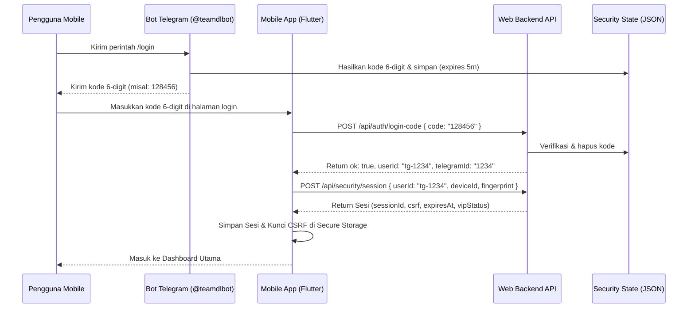

# Panduan Integrasi Aplikasi Mobile (Android & iOS) - TEAMDL

Dokumen ini berisi panduan teknis lengkap mengenai aplikasi mobile Flutter yang diintegrasikan ke backend dan database existing milik platform **TEAMDL**.

---

## 1. Struktur Proyek Mobile

Struktur proyek mobile diatur secara modular di bawah folder `/mobile` agar memudahkan pemeliharaan:

```text
mobile/
├── pubspec.yaml               # Deklarasi dependensi & aset
└── lib/
    ├── main.dart              # Entrypoint aplikasi & konfigurasi routing
    ├── models/
    │   ├── drama_model.dart   # Pemetaan objek serial drama
    │   ├── episode_model.dart # Pemetaan objek episode & subtitle
    │   ├── user_profile.dart  # Struktur profil Telegram & status VIP
    │   └── admin_models.dart  # Model tiket live chat & transaksi
    ├── services/
    │   ├── api_service.dart   # HTTP Client (Dio) dengan interceptor tanda tangan
    │   ├── secure_storage.dart# Penyimpanan terenkripsi untuk session key
    │   ├── firestore_service.dart # Sinkronisasi riwayat tontonan ke Firestore
    │   └── fcm_service.dart   # Penerima & navigator push notification FCM
    ├── providers/
    │   ├── auth_provider.dart # Pengendali sesi login & status autentikasi
    │   ├── theme_provider.dart# Pengatur tema Light/Dark Mode
    │   ├── playback_provider.dart # Pengendali riwayat & sinkronisasi favorit
    │   └── download_provider.dart # Pengelola antrean unduhan offline
    ├── player/
    │   └── video_player_screen.dart # Pemutar video premium (Chewie HLS)
    ├── admin/
    │   └── admin_dashboard.dart # Statistik, moderasi user, siaran & monitor CDN
    └── screens/
        ├── splash_screen.dart # Layar inisialisasi & validasi auto-login
        ├── login_screen.dart  # Halaman verifikasi kode 6-digit Telegram
        ├── home_screen.dart   # Halaman utama (Banner & Grid drama)
        ├── search_screen.dart # Pencarian realtime dengan filter genre/tahun
        ├── watchlist_screen.dart # Tab pengelola favorit & riwayat tontonan
        ├── profile_screen.dart# Informasi membership & akses ke panel admin
        └── settings_screen.dart # Konfigurasi tema, kualitas download & hapus cache
```

---

## 2. Autentikasi & Alur Login Telegram

Aplikasi mobile tidak membuat akun baru, melainkan menggunakan endpoint verifikasi Telegram milik website:



---

## 3. Protokol Keamanan & Tanda Tangan Request (HMAC-SHA256)

Untuk mencegah eksploitasi API dan modifikasi request, setiap endpoint sensitif dilindungi menggunakan penandatanganan request berbasis HMAC-SHA256:

1. **Parameter yang ditandatangani:**
   `message = "${method}:${path}:${timestamp}:${nonce}:${deviceHash}"`
   * `method`: Metode HTTP (GET/POST/PUT/DELETE) dalam huruf besar.
   * `path`: Endpoint relatif (contoh: `/api/user/profile?userId=tg-1234`).
   * `timestamp`: Waktu saat ini dalam milidetik (millisecond epoch).
   * `nonce`: String UUID acak unik sekali pakai.
   * `deviceHash`: Hasil SHA256 dari `deviceId:fingerprint`.

2. **Perhitungan Hash:**
   `signature = HMAC-SHA256(message, csrfToken)`
   Signature ini dikirimkan dalam header request: `X-Request-Signature`, bersama dengan `X-Request-Timestamp` dan `X-Request-Nonce`.
   Backend akan menghitung ulang string tersebut dengan kunci CSRF yang cocok dengan sesi cookie `mw_session` Anda. Jika signature tidak cocok, backend akan membalikkan error `403 Forbidden`.

---

## 4. Sinkronisasi Database Realtime

Sinkronisasi riwayat menonton dan watchlist dilakukan langsung menggunakan Firestore SDK:
1. Aplikasi mengambil berkas kredensial via `/api/firebase-config` saat startup.
2. Inisialisasi Firebase Core dilakukan secara runtime.
3. Sinkronisasi menggabungkan data lokal (`SharedPreferences`) dan remote (`Firestore`) menggunakan aturan: **Data dengan tanggal `updatedAt` terbaru yang menang.**
4. Riwayat tontonan dibatasi secara berkala hanya untuk 7 hari terakhir demi menghemat memori penyimpanan.

---

## 5. Panduan Build & Pengeluaran Build Output

Pastikan Flutter SDK dan Android SDK telah terpasang dengan benar di sistem Anda.

### A. Android

1. **Jalankan pembersihan proyek:**
   ```bash
   cd mobile
   flutter clean
   flutter pub get
   ```

2. **Build APK Debug (untuk pengujian internal):**
   ```bash
   flutter build apk --debug
   # Output tersimpan di: build/app/outputs/flutter-apk/app-debug.apk
   ```

3. **Build APK Release (siap diunduh langsung):**
   ```bash
   flutter build apk --release
   # Output tersimpan di: build/app/outputs/flutter-apk/app-release.apk
   ```

4. **Build Android App Bundle (AAB - siap upload ke Google Play Store):**
   ```bash
   flutter build appbundle --release
   # Output tersimpan di: build/app/outputs/bundle/release/app-release.aab
   ```

### B. iOS

1. **Inisialisasi Pods & Xcode workspace:**
   ```bash
   cd ios
   pod install
   cd ..
   ```

2. **Build IPA Archive (siap diunggah ke App Store Connect / TestFlight):**
   ```bash
   flutter build ipa --release
   # Output Xcode Archive (.xcarchive) tersimpan di build/ios/archive/
   # Ekspor berkas .ipa menggunakan Xcode Organizer.
   ```

---

## 6. Fitur Moderasi Admin (Mobile Panel)

Apabila pengguna memiliki role = `admin` dalam payload sesi login, menu **Panel Admin** akan diaktifkan secara otomatis pada halaman Profil. Menu tersebut mendukung:
- **User Online & Statistik:** Menampilkan volume user dan status database.
- **User Moderation:** Tombol sekali klik untuk melakukan Ban/Unban user, serta memberikan/mencabut status VIP.
- **Push Notification:** Memungkinkan admin mengirimkan broadcast darurat berisi notifikasi baru ke seluruh perangkat.
- **Stream Monitor:** Memantau log error CDN, API, atau server secara realtime untuk segera ditindaklanjuti.
